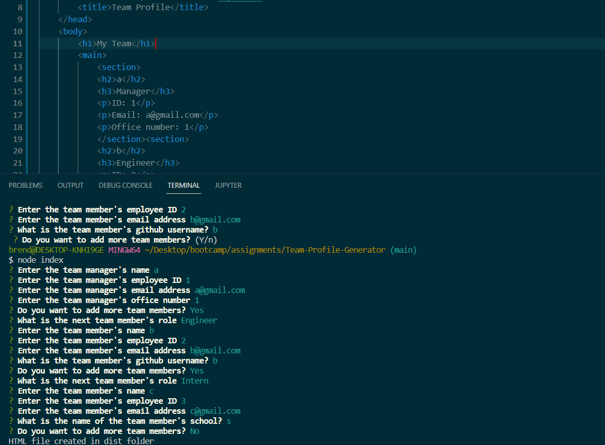
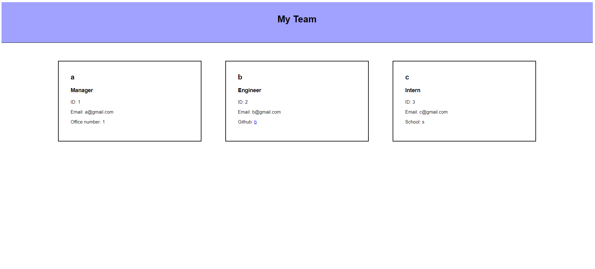

# Team-Profile-Generator

## Description

This application generates an HTML file for a webpage showing the information of the employees on a team after the user answers

## Installation

Clone this repository by opening a terminal in the folder which will hold it and enter "git clone https://github.com/BrendanShelton/Team-Profile-Generator.git". This application requires Node.js, Inquirer, and Inquirer-loop. Install dependencies by opening the root folder in a terminal and enter "npm i"

## Usage

After dependencies have been installed, Open the application in a terminal. Enter "node index" into the command line. Answer all the questions. The HTML file for the webpage displaying the team members' information will be generated in the dist folder.

https://github.com/BrendanShelton/Team-Profile-Generator

## Technologies used

HTML, CSS, Javascript, Node.js, Inquirer, Inquirer-loop, Jest

## Credits

N/A

## License

MIT License

Copyright (c) 2022 BrendanShelton

Permission is hereby granted, free of charge, to any person obtaining a copy
of this software and associated documentation files (the "Software"), to deal
in the Software without restriction, including without limitation the rights
to use, copy, modify, merge, publish, distribute, sublicense, and/or sell
copies of the Software, and to permit persons to whom the Software is
furnished to do so, subject to the following conditions:

The above copyright notice and this permission notice shall be included in all
copies or substantial portions of the Software.

THE SOFTWARE IS PROVIDED "AS IS", WITHOUT WARRANTY OF ANY KIND, EXPRESS OR
IMPLIED, INCLUDING BUT NOT LIMITED TO THE WARRANTIES OF MERCHANTABILITY,
FITNESS FOR A PARTICULAR PURPOSE AND NONINFRINGEMENT. IN NO EVENT SHALL THE
AUTHORS OR COPYRIGHT HOLDERS BE LIABLE FOR ANY CLAIM, DAMAGES OR OTHER
LIABILITY, WHETHER IN AN ACTION OF CONTRACT, TORT OR OTHERWISE, ARISING FROM,
OUT OF OR IN CONNECTION WITH THE SOFTWARE OR THE USE OR OTHER DEALINGS IN THE
SOFTWARE.
